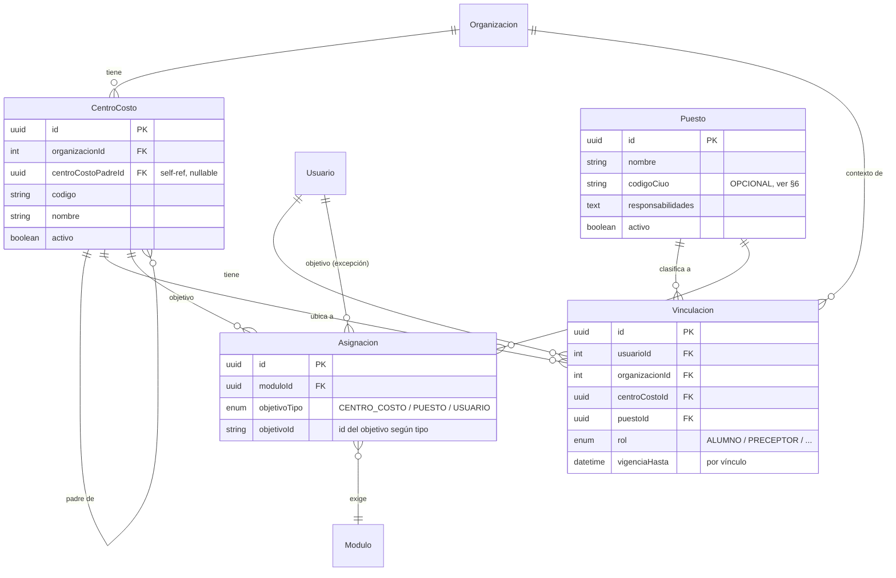
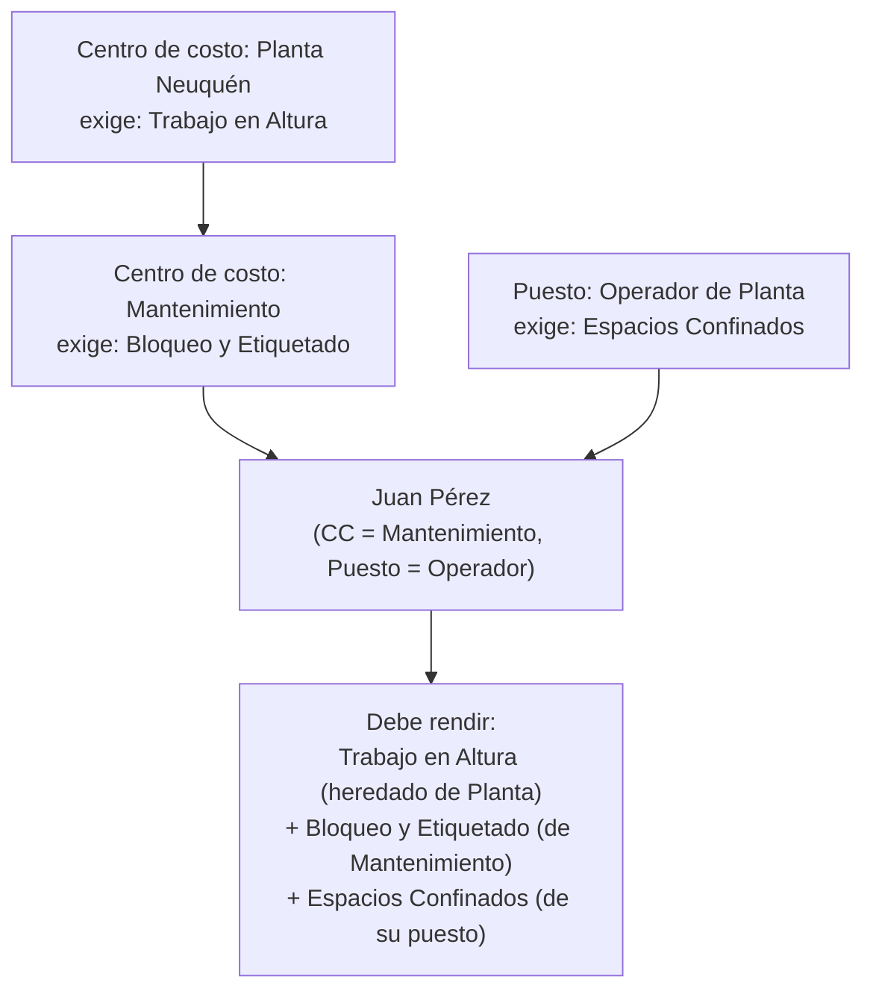

# SIMA Training — Asignación de capacitaciones por estructura organizacional

**Fecha:** 2026-07-13
**Deciders:** Equipo SIMA Training
**Tipo:** Propuesta de diseño (Story 6) — **no es implementación**. Documenta un modelo para
discutir y aprobar antes de escribir código.
**Input:** Story 6 (asignación por centro de costo / puesto) · `SIMA-Training-Arquitectura-y-Sprint1.md`
(§2 principio rector, §7 roadmap) · estado real del código a 2026-07-13.

> **Alcance de este documento.** Es una propuesta. Todo lo que aquí se llama "entidad nueva",
> "campo nuevo" o "a futuro" **todavía no existe** en el código. Lo que se marca como "existe hoy"
> fue verificado contra el código actual. Ninguna tarea de esta story toca schema, endpoints ni UI.

---

## 1. Contexto y objetivo

Hoy la asignación de un módulo a una persona es **uno a uno y manual**: en la pantalla de
Asignaciones un admin elige un usuario y un módulo, y crea una fila. No hay forma de decir
"todos los operadores de la Planta Neuquén deben rendir el módulo de Trabajo en Altura". A la
escala de un cliente Oil & Gas (cientos de personas, decenas de puestos), asignar persona por
persona no es viable y es propenso a huecos de cumplimiento.

El objetivo de este modelo es **asignar por estructura, no por individuo**: los módulos se
enganchan a la organización interna del cliente (centros de costo) y al rol operativo de cada
persona (puesto de trabajo), y el sistema **resuelve** qué le corresponde rendir a cada uno.
Una persona nueva que entra a un centro de costo hereda automáticamente lo que ese centro y su
puesto exigen, sin que nadie la asigne a mano.

**Qué es propuesta vs. qué queda para implementar.** Este doc define el modelo de datos, la regla
de resolución y el impacto. La implementación (schema, endpoints, migración de datos, pantallas)
es una o varias stories futuras, posteriores a la aprobación de esta propuesta y al arranque de
`Vinculacion` (ver §2).

### Estado actual (verificado)

| Concepto | Estado hoy |
|---|---|
| Asignación módulo↔persona | Mock de frontend, por individuo, sin backend (`Asignacion` no existe). No hay asignación grupal/bulk. |
| Puesto de trabajo | **Existe** como **texto libre** en `Usuario.datos.puesto` (jsonb), cargado por el import de Excel (`import.service.ts`, `COLUMN_MAP`) y editable en la ABM de Usuarios. No es catálogo ni está validado. |
| Centro de costo | No existe en ninguna forma (ni campo, ni jsonb, ni columna de import). |
| Códigos CIUO / ISCO | No existen. |
| `Modulo.vigenciaMeses` | **Existe** (Story 5): cadencia de recertificación en meses. Nada lo consume todavía. |
| `Vinculacion` | Documentada, **no construida**. Es el link persona↔organización previsto. |
| `Organizacion` | Árbol self-referencial tipado `CLIENTE/SUBCONTRATISTA/INTERNA` — modela cliente↔contratista, **no** unidades internas. |

---

## 2. Principio de diseño que gobierna la propuesta

> Centro de Costo y Puesto son **contexto laboral**, no identidad de la persona. Cuelgan de la
> `Vinculacion` (el vínculo persona↔organización), no del `Usuario`.

Esto es una consecuencia directa del principio rector de la arquitectura (arch doc §2: "separar la
identidad de la persona de su contexto laboral"). Sus implicancias:

- **Al cambiar de centro de costo o de puesto, cambia lo que la persona debe rendir** — pero su
  historial de capacitaciones aprobadas sigue con ella (`Capacitacion_Vigente` cuelga del `Usuario`,
  no del vínculo; arch doc §2). Un operador que se muda de planta no "pierde" sus aprobados.
- **La asignación efectiva se resuelve, no se materializa.** El sistema no crea una fila por cada
  (persona × módulo); guarda las asignaciones a nivel centro de costo / puesto y calcula al vuelo
  qué le toca a cada uno (§5). Esto es coherente con la visión del arch doc §2 ("el sistema es un
  registro de hechos, no un motor de reglas") — la única "regla" es una unión de conjuntos, barata
  de calcular.
- **Depende de que exista `Vinculacion`.** Este modelo no puede implementarse antes de arrancar
  esa entidad. Es su primer caso de uso concreto y le da forma a sus campos (§3.3).

---

## 3. Modelo de datos propuesto



### 3.1 `CentroCosto` — nueva entidad con jerarquía propia

Un centro de costo es una unidad organizativa **interna del cliente** (ej. `YPF · Planta Neuquén ·
Mantenimiento`), con estructura padre/hijo. Se modela como una entidad dedicada con:

- `organizacionId` — FK a la `Organizacion` (cliente) dueña del centro de costo.
- `centroCostoPadreId` — FK self-referencial nullable, para la jerarquía interna (planta → área →
  sector). El mismo patrón de árbol que ya usa `Organizacion.organizacionPadreId`.
- `codigo`, `nombre`, `activo` + trazabilidad.

**Decisión: entidad `CentroCosto` dedicada, no extender el árbol de `Organizacion`.**

| Opción | A favor | En contra |
|---|---|---|
| Extender `Organizacion` con un `tipo = CENTRO_COSTO` | Reusa el árbol self-referencial existente | Mezcla dos ejes distintos en la misma tabla: el eje **legal** (cliente↔subcontratista, "quién trabaja para quién") con el eje **interno** (unidades dentro de una empresa). Ensucia toda query que hoy asume que `Organizacion` = empresa. |
| **Entidad `CentroCosto` dedicada (elegida)** | Separa los dos ejes; las queries de empresas no se ven afectadas; la jerarquía interna puede tener sus propias reglas | Una tabla y una relación más |

El eje legal y el eje interno son ortogonales (un centro de costo pertenece a un cliente, pero no
*es* un cliente ni un subcontratista). Mantenerlos en tablas separadas evita el tipo de "arrastre"
que el arch doc §3.4-e ya marcó como riesgo al mezclar conceptos en una sola entidad.

### 3.2 `Puesto` — promover de texto libre a catálogo estructurado

Hoy `puesto` es un string suelto en `Usuario.datos.puesto` (ej. "Operador de Planta"), sin
validación ni catálogo. Se propone promoverlo a una entidad `Puesto`:

- `nombre` — el nombre del puesto (ej. "Operador de Planta", "Supervisor HSE").
- `responsabilidades` — texto/estructura que documenta qué hace ese puesto (§4).
- `codigoCiuo` — **opcional**, agrupador secundario para reportes cruzados (§6).
- `activo` + trazabilidad.

**Migración liviana desde lo que ya existe.** Los valores actuales de `datos.puesto` se recolectan,
se deduplican y se cargan como filas iniciales del catálogo `Puesto`; cada `Vinculacion` apunta a la
fila correspondiente. El campo `datos.puesto` (jsonb) queda como dato histórico hasta completar la
migración. Esto es exactamente el camino que el arch doc §3.4-a previó: "los campos del jsonb que se
estabilicen se promueven a columnas/entidades reales cuando se cierre el mapeo".

### 3.3 `Vinculacion` — arranque, con centro de costo y puesto

Esta propuesta le da a `Vinculacion` (hasta hoy solo documentada) su primer caso de uso concreto y
define sus campos mínimos: `usuarioId`, `organizacionId`, `centroCostoId`, `puestoId`, `rol` y
`vigenciaHasta` (vencimiento por vínculo, como pide el arch doc §7.1 para subcontratistas).

Queda enganchada a la **pregunta abierta #1** del arch doc (¿un usuario puede tener varias
vinculaciones activas a la vez, 1:1 vs 1:N?). Para este modelo alcanza con asumir **una vinculación
activa por persona** al principio; soportar varias es una extensión posterior que no rompe la regla
de resolución (§5), solo la aplica sobre cada vínculo activo.

### 3.4 `Asignacion` — objetivo polimórfico, sin duplicar por persona

Una `Asignacion` conecta un `Modulo` con un **objetivo**, que puede ser un `CentroCosto`, un
`Puesto` o (excepcionalmente) un `Usuario` puntual. No se crea una fila por persona: hay una fila
"el módulo X se exige al centro de costo Y", y la pertenencia de cada persona se resuelve al vuelo
(§5). El objetivo individual (`USUARIO`) queda para casos de excepción (una capacitación puntual a
una sola persona), preservando lo único que el modelo mock actual sabe hacer.

---

## 4. Responsabilidades por puesto

Cada `Puesto` documenta las **responsabilidades** que justifican los módulos que se le exigen. Esto
no es decorativo: es la trazabilidad que pide ISO 9001 y que va a consumir el futuro producto SIMA
AUDITS — poder responder "¿por qué esta persona debía rendir este módulo?" con "porque su puesto
tiene esta responsabilidad".

Ejemplo del mapeo responsabilidad → módulos (ilustrativo, no es data real):

| Puesto | Responsabilidades | Módulos que la responsabilidad exige |
|---|---|---|
| Operador de Planta | Opera equipos de proceso; interviene en espacios confinados | Trabajo en Altura · Espacios Confinados · SIMA Básico |
| Supervisor HSE | Audita cumplimiento; lidera respuesta a emergencias | Investigación de Incidentes · Primeros Auxilios · SIMA Avanzado |
| Chofer de Cargas | Transporta materiales peligrosos | Manejo Defensivo · Transporte de Sustancias Peligrosas |

La tabla es una **guía de negocio**: cuando un admin crea la `Asignacion` de un módulo a un puesto,
las responsabilidades documentadas son el criterio que sustenta esa decisión y la deja auditable.

---

## 5. Resolución de la asignación (cascada centro de costo → puesto)

**Regla: unión de conjuntos.** Los módulos que le corresponden a una persona son la unión de todo
lo que aplica por sus distintos ejes:

```
módulos(persona) =
      módulos asignados a su centro de costo   (y a TODOS los centros de costo ancestros)
    ∪ módulos asignados a su puesto
    ∪ módulos asignados a ella individualmente
```

- **La cascada de centro de costo sube por la jerarquía.** Un módulo asignado a `Planta Neuquén`
  aplica a todos los centros de costo hijos (`Mantenimiento`, `Producción`, …) y a toda persona
  ubicada en ellos. Se asigna una vez en el padre en vez de repetirlo en cada hijo.
- **El puesto solo agrega.** No puede quitar un módulo heredado del centro de costo. Es la opción
  más simple y predecible.
- **Recertificación:** cada módulo resuelto arrastra su `Modulo.vigenciaMeses` (Story 5). Una
  asignación no es un evento único: vence y se vuelve a exigir según esa cadencia.



**Por qué unión y no reemplazo/exclusión.** En capacitaciones de seguridad industrial, exigir "de
más" es tolerable (a lo sumo alguien rinde un módulo que ya sabía); exigir "de menos" es un riesgo
real de habilitar a alguien sin la capacitación que necesitaba. La unión es también la regla más
fácil de auditar: para cada módulo exigido siempre existe un objetivo (centro de costo, puesto o
persona) que lo explica, sin excepciones ocultas. Si en la práctica aparece la necesidad de "este
puesto NO necesita tal módulo heredado", se puede sumar una regla de exclusión más adelante — pero
se arranca sin ella a propósito, para no complicar el modelo antes de tener el problema.

---

## 6. Evaluación de códigos CIUO (ISCO-08)

La Story 6 pide "evaluar englobar puestos usando códigos CIUO". Se evalúa acá; **no se compromete**
su adopción.

**Qué es.** CIUO (Clasificación Internacional Uniforme de Ocupaciones; en inglés ISCO-08) es un
estándar de la OIT que codifica ocupaciones en una jerarquía de 4 dígitos (gran grupo → subgrupo →
grupo primario → ocupación). Ej.: `8` Operadores de instalaciones y máquinas → `83` Conductores →
`833` Conductores de camiones pesados.

| A favor | En contra |
|---|---|
| Estándar internacional: un lenguaje común de ocupaciones | Los puestos industriales reales rara vez mapean 1:1 a un código CIUO (un "Operador de Planta" cae en varios) |
| Permite **agrupar puestos heterogéneos entre clientes** distintos bajo un mismo código, y asignar un módulo a un grupo CIUO en vez de puesto por puesto | Overhead de codificar cada puesto; requiere criterio y mantenimiento |
| Interoperable con sistemas de RRHH que ya lo usen | Riesgo de forzar el mapeo y terminar con códigos que no reflejan el puesto real |
| Habilita reportes de cumplimiento comparables entre empresas | Beneficio real recién aparece cuando hay muchos clientes con puestos distintos que conviene comparar |

**Recomendación (decisión abierta).** Incluir `codigoCiuo` como campo **opcional** en `Puesto`,
como **agrupador secundario** — nunca como la clave del catálogo (la identidad del puesto es su
`nombre`, no su código). Así se puede empezar sin codificar nada y adoptar CIUO gradualmente, solo
en los puestos donde aporte, si aparece la necesidad concreta de reportes cruzados entre clientes.
Se evita el riesgo de atar el catálogo a un estándar cuyo beneficio todavía no se materializó, sin
cerrar la puerta a usarlo. La decisión de adoptarlo (y con qué profundidad) queda para cuando
exista esa necesidad de reporte.

---

## 7. Impacto en pantallas y camino de migración

Nada de esto se hace en esta story; es el mapa de lo que la implementación futura tocaría.

- **ABMs nuevos:** `CentroCosto` (con su jerarquía, colgando de un cliente) y `Puesto` (catálogo con
  responsabilidades y `codigoCiuo` opcional).
- **Pantalla de Asignaciones:** pasa de "elegir un usuario + un módulo" a poder elegir el **objetivo**
  (centro de costo, puesto o usuario) + el módulo. La vista por individuo se mantiene como caso de
  excepción y para inspeccionar la asignación **resuelta** de una persona ("¿qué le toca a Juan y por
  qué?").
- **Import de Excel:** el `COLUMN_MAP` (`import.service.ts`) gana columnas `centro_costo` y, opcional,
  `codigo_ciuo`; `puesto` deja de ir a `datos.puesto` (jsonb) y pasa a resolver/crear una fila del
  catálogo `Puesto`.
- **Migración de datos:** los `Usuario.datos.puesto` actuales se deduplican en filas de `Puesto` y se
  enganchan vía `Vinculacion`. El jsonb queda como respaldo histórico hasta cerrar la migración.

---

## 8. Preguntas abiertas / riesgos

1. **Vinculaciones simultáneas (1:1 vs 1:N)** — hereda la pregunta abierta #1 del arch doc. Si una
   persona puede tener dos vínculos activos (dos centros de costo a la vez), la regla de unión (§5) se
   aplica sobre cada vínculo — hay que decidir si se unen entre sí o se mantienen separados por vínculo.
2. **¿El centro de costo lo define SIMA o lo provee el cliente?** Condiciona si es data que SIMA
   administra en un ABM o que llega por el import de nómina del cliente (o ambas).
3. **¿El catálogo de `Puesto` es global o por cliente?** Un "Operador de Planta" de YPF, ¿es el mismo
   puesto que el de Pluspetrol, o son puestos distintos que casualmente se llaman igual? Afecta si el
   catálogo se comparte o se scopea por `Organizacion`. (CIUO, si se adopta, sería justamente el eje
   que permite compararlos sin unificarlos.)
4. **Persona sin centro de costo o sin puesto asignado** — definir el comportamiento por defecto:
   ¿no se le exige nada?, ¿solo lo individual?, ¿se la marca como incompleta para que un admin la
   complete? Impacta el % de cumplimiento de los reportes (arch doc §7.3).

---

## 9. Resumen para decidir

- Centro de Costo = **entidad dedicada** con jerarquía propia, colgando de un cliente. No se mezcla
  con el árbol de `Organizacion`.
- Puesto = **catálogo estructurado** (promovido desde el texto libre de hoy), con responsabilidades
  documentadas y `codigoCiuo` opcional.
- Ambos cuelgan de `Vinculacion` (contexto laboral), cuyo arranque este modelo motiva y define.
- La asignación efectiva se **resuelve por unión**: centro de costo (con cascada por jerarquía) +
  puesto + individual. El puesto solo agrega. Recertificación vía `Modulo.vigenciaMeses`.
- CIUO: **opcional y secundario**, adopción gradual, decisión dejada abierta.

Aprobada esta propuesta, la implementación se planifica como stories separadas, después (o junto
con) el arranque de `Vinculacion`.
