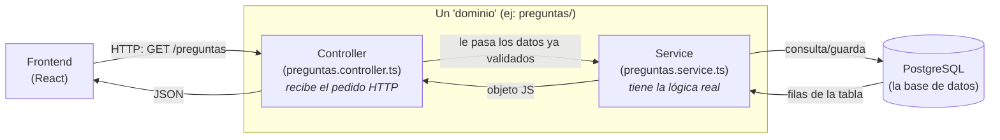
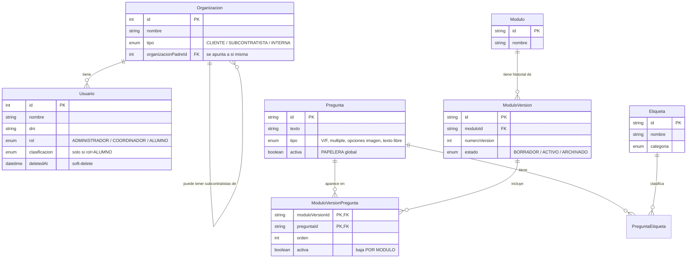
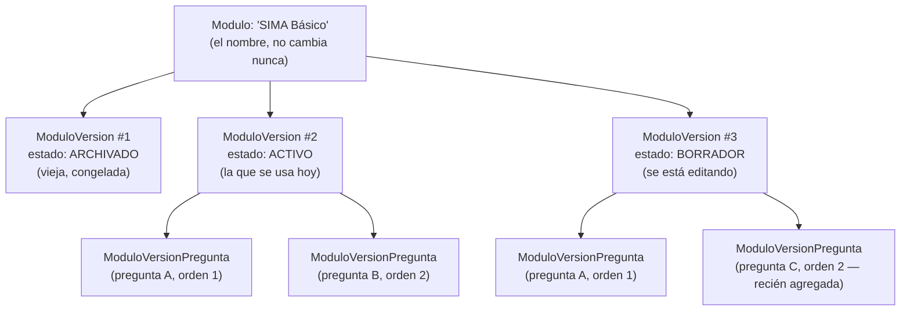

# Arquitectura del backend — guía de orientación

Este documento explica **qué hay** en el backend de SIMA Training y **cómo se relaciona entre sí**, pensado para alguien que recién se está metiendo a este proyecto y viene con bases de bases de datos (relaciones, claves foráneas) pero no mucha experiencia todavía con un backend "real".

No es documentación exhaustiva — para eso está el código y `CLAUDE.md`. Esto es el mapa para no perderte.

---

## 1. ¿Qué es esto, en una frase?

Un servidor (NestJS + PostgreSQL) que guarda y expone por HTTP toda la información de la plataforma: usuarios, empresas, y el banco de preguntas/módulos de capacitación (SIMA CHECK). El frontend (`sima-training-backoffice`) le hace pedidos HTTP (GET, POST, PATCH...) y este backend responde con JSON, leyendo o escribiendo en la base de datos.

---

## 2. Cómo está organizado el código (las 3 capas)

Casi todo el código sigue siempre el mismo patrón de 3 capas. Si entendés este dibujo, entendés el 80% del proyecto:

- **Controller**: es la "puerta de entrada". Define qué URL responde (`@Get()`, `@Post()`, etc.) y qué forma debe tener el body (usando un **DTO**, que es solo una clase que describe "estos campos, con este tipo, obligatorios u opcionales"). No tiene lógica de negocio.
- **Service**: acá vive la lógica real ("si la pregunta no existe, tirar error 404", "si desactivo una pregunta, desactivar también sus asignaciones"). Es el que habla con la base de datos.
- **Prisma**: es el **ORM** — una librería que te deja escribir `prisma.pregunta.findMany(...)` en vez de escribir SQL a mano. Vos definís tus tablas en `schema.prisma` y Prisma genera código TypeScript para usarlas.

Cada carpeta dentro de `src/` (`usuarios/`, `preguntas/`, `modulos/`, etc.) es un **dominio** y repite este mismo patrón: `algo.controller.ts` + `algo.service.ts` + una carpeta `dto/`.

---

## 3. ⚠️ Ojo con una trampa de nombres

NestJS le dice **"módulo"** (`@Module`) a una unidad de organización de código (un archivo `algo.module.ts` que agrupa un controller + un service). Es un concepto de **arquitectura**.

Pero en este proyecto **también existe una entidad de negocio que se llama `Modulo`** (con mayúscula, sin la "s" en NestJS) — que representa un **módulo de capacitación** de SIMA CHECK (ej: "SIMA Básico"). Es un concepto del **dominio**.

Son dos cosas totalmente distintas que comparten nombre por casualidad. Cuando en este documento diga "módulo NestJS" me refiero a la carpeta/organización de código; cuando diga "el `Modulo`" (la entidad) me refiero a la capacitación.

---

## 4. El modelo de datos (las entidades)

Estas son las "clases" de negocio reales — cada una es una tabla en PostgreSQL, definida en `prisma/schema.prisma`. Un poco de contexto de cada una:

| Entidad | Qué representa |
|---|---|
| `Organizacion` | Una empresa: un cliente (ej. YPF), un subcontratista, o "Ingeniería SIMA" (la empresa dueña de la plataforma). |
| `Usuario` | Cualquier persona: un admin del backoffice, un coordinador, o un alumno que rinde evaluaciones. |
| `Pregunta` | Una pregunta del banco de evaluación (única, se reusa en varios módulos). |
| `Etiqueta` | Una categoría para clasificar preguntas (ej: tema "Seguridad eléctrica"). |
| `Modulo` | Un módulo de capacitación (ej. "SIMA Básico"). Es solo un contenedor estable — el contenido real vive en `ModuloVersion`. |
| `ModuloVersion` | Una **versión** del contenido de un módulo (ver sección 6). |

Y dos **tablas pivot** (tablas intermedias que existen solo para conectar dos entidades en una relación muchos-a-muchos — seguro las viste en tu curso de bases de datos):

| Pivot | Conecta | Para qué |
|---|---|---|
| `PreguntaEtiqueta` | `Pregunta` ↔ `Etiqueta` | Una pregunta puede tener varias etiquetas, una etiqueta se usa en varias preguntas. |
| `ModuloVersionPregunta` | `ModuloVersion` ↔ `Pregunta` | Qué preguntas tiene cada versión de un módulo, en qué orden, y si están activas en ese módulo. |

### Diagrama de relaciones

Cómo leer las flechas: `Organizacion ||--o{ Usuario` se lee "una Organizacion tiene cero o muchos Usuarios" — es exactamente la relación 1-a-N que ya conocés de bases de datos, con una clave foránea (`organizacionId`) del lado de `Usuario`.

---

## 5. La relación más "rara": `Organizacion` apuntándose a sí misma

`Organizacion.organizacionPadreId` es una clave foránea que apunta **a la misma tabla** `Organizacion`. Sirve para modelar la jerarquía: un subcontratista "cuelga" de un cliente. Es el mismo truco que un árbol genealógico en SQL (cada fila puede tener un "padre" que es otra fila de la misma tabla).

---

## 6. El patrón más particular del proyecto: `Modulo` + `ModuloVersion`

Esto es probablemente lo menos intuitivo, así que vale la pena un ejemplo.

**La regla de negocio**: un módulo de capacitación, una vez publicado, **nunca se edita en el lugar**. Si querés cambiar sus preguntas, se crea una **versión nueva**; la versión vieja queda congelada para siempre (`ARCHIVADO`), para no perder el historial de qué evaluó a cada alumno en su momento.

Por eso `Modulo` es solo un "nombre estable" (id + nombre), y todo el contenido real (qué preguntas tiene, en qué orden) vive en `ModuloVersion`, que puede tener varias filas por cada `Modulo` (`numeroVersion` 1, 2, 3...).

En cualquier momento hay como máximo una versión `ACTIVO` (la que efectivamente rinden los alumnos) y como mucho una `BORRADOR` (donde un admin está armando la próxima). Todas las demás quedan `ARCHIVADO`.

---

## 7. Sobre el polimorfismo que preguntaste

Ojo, en este backend **no vas a encontrar herencia de clases al estilo clásico de POO** (tipo `Animal` → `Perro`/`Gato` con métodos que se sobreescriben). Los "modelos" de Prisma no son clases con herencia, son definiciones de tablas.

Lo que sí vas a ver es algo que cumple un rol parecido, pero con otra herramienta: el campo `Pregunta.tipo` es un **enum** (`VERDADERO_FALSO`, `OPCION_MULTIPLE`, `OPCIONES_IMAGEN`, `TEXTO_LIBRE`) que decide qué forma tiene el campo `opciones` (un JSON libre). En vez de tener 4 subclases de `Pregunta`, hay una sola tabla con un campo que dice "cuál de las 4 formas tiene esta fila". Es una técnica muy común en bases de datos relacionales para resolver algo que en POO resolverías con polimorfismo — a veces se la llama "polimorfismo de datos" o "single-table pattern".

---

## 8. Las tres formas distintas de "dar de baja" (esta es la parte que más confunde)

El proyecto tiene **tres mecanismos de baja, todos distintos, en tres lugares distintos**. Vale la pena tenerlos bien separados en la cabeza:

| Dónde vive | Campo | Qué significa | Ejemplo |
|---|---|---|---|
| `Usuario.deletedAt` | fecha o `null` | Baja de un usuario. Si tiene fecha, ese usuario "no existe más" para el sistema (pero la fila sigue en la base, por trazabilidad). | Se fue un empleado de la empresa. |
| `Pregunta.activa` | `true`/`false` | **Papelera global** de una pregunta: la saca de **todo** el banco, en cualquier módulo donde estuviera. | La pregunta está mal escrita y no se usa nunca más. |
| `ModuloVersionPregunta.activa` | `true`/`false` | Baja **por módulo**: la pregunta sigue existiendo en el banco y en otros módulos, pero no se usa en **este** módulo en particular. | La pregunta es válida, pero no aplica a "SIMA Básico". |

Un detalle de diseño importante: cuando mandás una pregunta a la papelera global (`Pregunta.activa = false`), el backend automáticamente pone `ModuloVersionPregunta.activa = false` en **todas** sus asignaciones (para que desaparezca de todos los módulos a la vez). Pero al revés — cuando la "recuperás" de la papelera — **no** se reactivan solas sus asignaciones por módulo; eso es una decisión a propósito para no adivinar en qué módulos el admin realmente la quiere de vuelta.

---

## 9. Recorrido de ejemplo (para fijar todo lo anterior)

Imaginate que un admin crea el módulo "SIMA Básico" y le agrega dos preguntas del banco:

1. `POST /modulos { nombre: "SIMA Básico" }` → se crea una fila en `Modulo`, y automáticamente una fila en `ModuloVersion` con `numeroVersion: 1, estado: BORRADOR`.
2. `POST /modulos/:id/preguntas` con dos ids de `Pregunta` que ya existían en el banco → se crean dos filas en `ModuloVersionPregunta`, cada una apuntando a esa `ModuloVersion` (la BORRADOR) y a una `Pregunta`, con su `orden`.
3. Ninguna `Pregunta` se duplicó — las dos preguntas pueden estar, al mismo tiempo, asignadas a otro módulo también (ese es el sentido de tener un pivot en vez de guardar las preguntas adentro de `Modulo` directamente).
4. Si más adelante el admin decide que una de esas preguntas no aplica a este módulo, hace `PATCH /modulos/:id/preguntas/:preguntaId { activa: false }` → solo se actualiza esa fila del pivot. La `Pregunta` sigue intacta y visible en el resto de los módulos.

---

## 10. Mapa de todos los dominios (`src/`)

| Carpeta | Responsabilidad | Endpoints principales |
|---|---|---|
| `auth/` | Login básico (usuario/contraseña fijos por variable de entorno) y emisión de un token JWT. | `POST /auth/login` |
| `usuarios/` | ABM de personas (admins, coordinadores, alumnos), con baja lógica (`deletedAt`). | CRUD `/usuarios` |
| `organizaciones/` | ABM de empresas/clientes, con la jerarquía cliente→subcontratista. | CRUD `/organizaciones` |
| `import/` | Subir un Excel de nómina de empleados, previsualizar y confirmar la carga masiva. | `POST /import/usuarios/preview`, `/confirm` |
| `etiquetas/` | Categorías para clasificar preguntas. | `POST/GET /etiquetas` |
| `preguntas/` | El banco de preguntas (único, compartido entre módulos) + la papelera global. | CRUD parcial `/preguntas`, `PATCH /preguntas/:id` |
| `modulos/` | Módulos de capacitación, sus versiones, y la asignación/baja de preguntas por módulo. | `/modulos`, `/modulos/:id/preguntas` |
| `prisma/` | No es un dominio — es el servicio que conecta con la base de datos, usado por todos los demás. | — |
| `health/` | Endpoint para chequear que el server está vivo. | `GET /health` |

Fijate que `preguntas/` **depende de** `modulos/` (importa su `ModulosService` para saber, dado un conjunto de módulos, cuál es la versión vigente de cada uno). Es la única dependencia cruzada entre dominios que hay hoy — el resto son independientes entre sí.

---

## 11. Glosario rápido

- **ORM**: librería que traduce entre "objetos de tu lenguaje" (TypeScript) y "filas de una tabla SQL", para no escribir SQL a mano. Acá es **Prisma**.
- **Migración**: un archivo que describe un cambio en la estructura de la base de datos (agregar una columna, una tabla) para poder aplicarlo de forma ordenada y repetible. Viven en `prisma/migrations/`.
- **DTO** (Data Transfer Object): una clase que solo describe la forma de los datos que entran o salen por HTTP (qué campos, qué tipo, cuáles son obligatorios). No tiene lógica.
- **Guard**: un chequeo que corre antes de que el Controller procese el pedido — acá se usa `JwtAuthGuard` para exigir un token válido en los endpoints de escritura (crear/editar).
- **JWT**: un token firmado que probás una vez (con usuario/contraseña) y después mandás en cada pedido protegido, en vez de mandar la contraseña de nuevo.
- **Soft-delete** ("baja lógica"): en vez de borrar la fila de la base de datos, se marca con un campo (`deletedAt`, o un booleano `activa`) para poder recuperarla o auditarla después.
